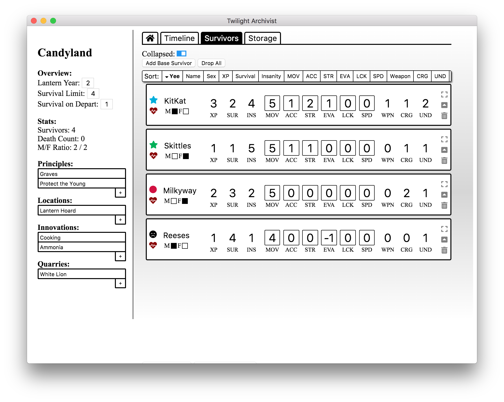
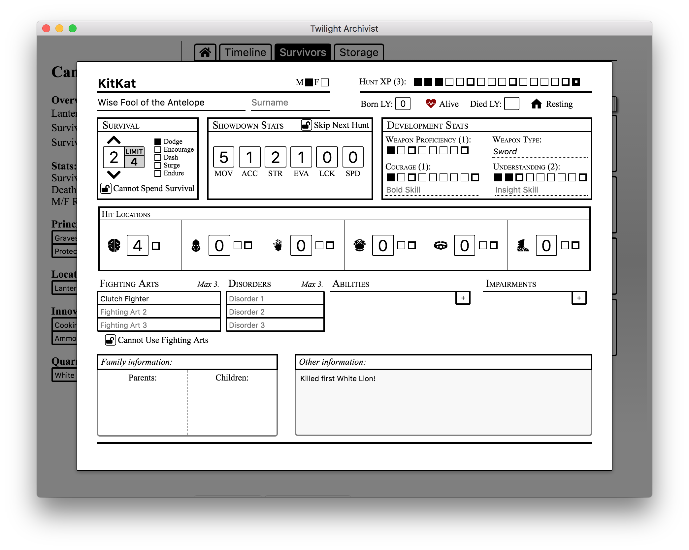

# Twilight Archivist

A Kingdom Death: Monster Companion App from one board game enthusiast to another.

<p align="center">
  
  
</p>

## Status

The project is currently in Alpha and changing by the day! We estimate that a solid first stable release will be out within the next week or two, so stay tuned!

## Pillars

The guiding principles for this project are:

1. **Focus on Pen and Paper Gameplay:** The app shouldn't distract you from the game, and we truly believe part of the experience is being together, and physically interacting with the game materials.
2. **Open Source:** We want to give back to the community, and allow the community to help in this project.
3. **Usability:** The application should be easy to use, intuitive, and efficient--focus on the board, not the app!
4. **Good Looks:** While you shouldn't be staring at this app... we like pretty things!
5. **Emerging Stories:** Sometimes the narrative can get lost in all of the dice rolling and card shuffling. The app should help capture the stories of the survivors and the entire settlement without any extra work--so you can live the tale without any extra effort.

## Install

Once we hit a stable release, we will be building the application for all platforms (thanks to Electron's deployability).

For now, or to install from source in the future, you can install and run via [npm](https://www.npmjs.com/):

```sh
# Install dependencies
npm i

# Run the project in development mode
npm run dev
```

## Authors
Twilight Archivist is the brain child of [Alex Karle](https://github.com/akarle) and [Makenzie Scwhartz](https://github.com/mws96).

We're two recent UMass Amherst grads just having a good time and enjoying our newfound free time by making this app!

## Contributing

As board game enthusiasts ourselves, we would love your feedback and help! If you come accross a bug, no matter how small, open an issue!

If you're interested in helping out, feel free to [contact us](mailto:twilightarchivistapp@gmail.com) to get a feel for what we are currently working on, or just open a pull request and we'll check it out!
